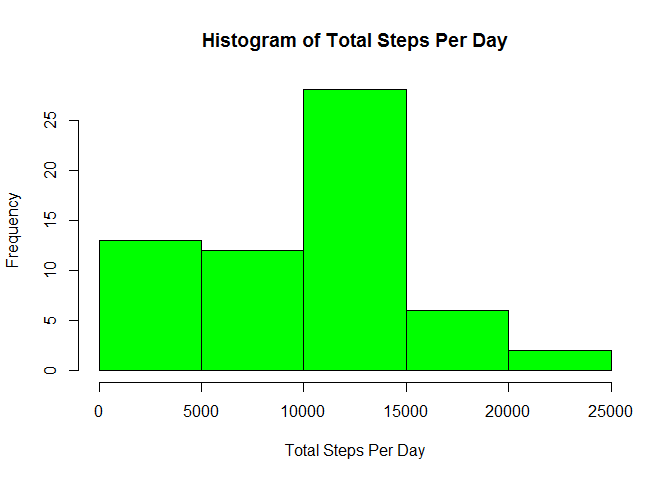
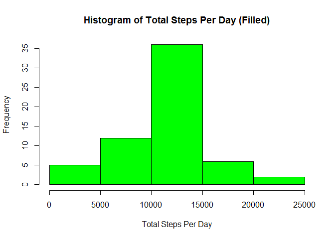
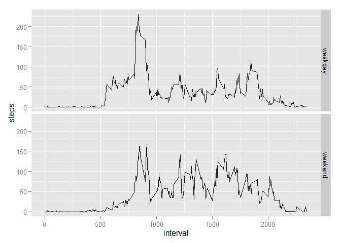

# Reproducible Research: Peer Assessment 1
yxl1108  
Saturday, April 18, 2015  

## Loading and preprocessing the data


```r
# unzip and import
unzip("activity.zip")
activity <- read.csv("activity.csv", sep = ",", header = TRUE)

# convert date to POSIXct and add POSIXct data type for date and interval
activity$date<-strptime(activity$date, "%Y-%m-%d")
activity <- transform(activity, datetime = as.POSIXct(paste(date, sprintf("%04d", interval)), format = "%Y-%m-%d %H%M"))
```
## What is mean total number of steps taken per day?

1. Calculate the total number of steps taken per day


```r
activitySum <- setNames(aggregate(activity$steps, by=list(as.character(activity$date)), FUN = sum, na.rm = TRUE), c("date","steps"))
activitySum
```

```
##          date steps
## 1  2012-10-01     0
## 2  2012-10-02   126
## 3  2012-10-03 11352
## 4  2012-10-04 12116
## 5  2012-10-05 13294
## 6  2012-10-06 15420
## 7  2012-10-07 11015
## 8  2012-10-08     0
## 9  2012-10-09 12811
## 10 2012-10-10  9900
## 11 2012-10-11 10304
## 12 2012-10-12 17382
## 13 2012-10-13 12426
## 14 2012-10-14 15098
## 15 2012-10-15 10139
## 16 2012-10-16 15084
## 17 2012-10-17 13452
## 18 2012-10-18 10056
## 19 2012-10-19 11829
## 20 2012-10-20 10395
## 21 2012-10-21  8821
## 22 2012-10-22 13460
## 23 2012-10-23  8918
## 24 2012-10-24  8355
## 25 2012-10-25  2492
## 26 2012-10-26  6778
## 27 2012-10-27 10119
## 28 2012-10-28 11458
## 29 2012-10-29  5018
## 30 2012-10-30  9819
## 31 2012-10-31 15414
## 32 2012-11-01     0
## 33 2012-11-02 10600
## 34 2012-11-03 10571
## 35 2012-11-04     0
## 36 2012-11-05 10439
## 37 2012-11-06  8334
## 38 2012-11-07 12883
## 39 2012-11-08  3219
## 40 2012-11-09     0
## 41 2012-11-10     0
## 42 2012-11-11 12608
## 43 2012-11-12 10765
## 44 2012-11-13  7336
## 45 2012-11-14     0
## 46 2012-11-15    41
## 47 2012-11-16  5441
## 48 2012-11-17 14339
## 49 2012-11-18 15110
## 50 2012-11-19  8841
## 51 2012-11-20  4472
## 52 2012-11-21 12787
## 53 2012-11-22 20427
## 54 2012-11-23 21194
## 55 2012-11-24 14478
## 56 2012-11-25 11834
## 57 2012-11-26 11162
## 58 2012-11-27 13646
## 59 2012-11-28 10183
## 60 2012-11-29  7047
## 61 2012-11-30     0
```

2. Make a histogram of the total number of steps taken each day


```r
hist(activitySum$steps, main="Histogram of Total Steps Per Day", xlab="Total Steps Per Day", col="green")
```

 

3. Calculate and report the mean and median total number of steps taken per day


```r
#setNames(aggregate(activity$steps, by=list(as.character(activity$date)), FUN = mean, na.rm = TRUE), c("date","meanSteps"))
#setNames(aggregate(activity$steps, by=list(as.character(activity$date)), FUN = median, na.rm = TRUE), c("date","medianSteps"))
summary(activitySum$steps)
```

```
##    Min. 1st Qu.  Median    Mean 3rd Qu.    Max. 
##       0    6778   10400    9354   12810   21190
```

## What is the average daily activity pattern?

1. Make a time series plot (i.e. type = "l") of the 5-minute interval (x-axis) and the average number of steps taken, averaged across all days (y-axis)


```r
activityMeanInterval <- setNames(aggregate(activity$steps, by=list(activity$interval), FUN = mean, na.rm = TRUE), c("interval","steps"))
plot(activityMeanInterval$interval, activityMeanInterval$steps, type="l", xlab= "5-minute interval", ylab= "average steps", col="green" , lwd=1)
```

 

2. Which 5-minute interval, on average across all the days in the dataset, contains the maximum number of steps?


```r
groupbyInterval <- setNames(aggregate(activity$steps, by=list(activity$interval), FUN = sum, na.rm = TRUE), c("interval","steps"))

#interval 835 contains the maximum number of steps
head(groupbyInterval[order(-groupbyInterval$steps, groupbyInterval$interval),])
```

```
##     interval steps
## 104      835 10927
## 105      840 10384
## 107      850  9720
## 106      845  9517
## 103      830  9397
## 101      820  9071
```

## Inputing missing values

1. Calculate and report the total number of missing values in the dataset (i.e. the total number of rows with NAs)


```r
length(which(is.na(activity)))
```

```
## [1] 2304
```

2. Devise a strategy for filling in all of the missing values in the dataset. (The strategy is using the mean for that 5-minute interval to fill the missing values)

3. Create a new dataset that is equal to the original dataset but with the missing data filled in.


```r
# find average steps group by interval where steps is not NA
groupbyIntervalMean <- setNames(aggregate(activity$steps, by=list(activity$interval), FUN = mean, na.rm = TRUE), c("interval","meanSteps"))
#join the table to activity by interval
activityFill <- merge(activity, groupbyIntervalMean, by = "interval")
#update NA steps with the average steps for interval
activityFill <- within(activityFill, {steps <- ifelse(!is.na(steps), steps, meanSteps)})
```
summary of steps in data frame activity

```r
summary(activity$steps)
```

```
##    Min. 1st Qu.  Median    Mean 3rd Qu.    Max.    NA's 
##    0.00    0.00    0.00   37.38   12.00  806.00    2304
```
summary of steps in data frame activityFill

```r
summary(activityFill$steps)
```

```
##    Min. 1st Qu.  Median    Mean 3rd Qu.    Max. 
##    0.00    0.00    0.00   37.38   27.00  806.00
```

4. Make a histogram of the total number of steps taken each day and Calculate and report the mean and median total number of steps taken per day. Do these values differ from the estimates from the first part of the assignment? What is the impact of inputing missing data on the estimates of the total daily number of steps?


Make a histogram of the total number of steps taken each day (Filled)

```r
activityFillSum <- setNames(aggregate(activityFill$steps, by=list(as.character(activityFill$date)), FUN = sum), c("date","steps"))
hist(activityFillSum$steps, main="Histogram of Total Steps Per Day (Filled)", xlab="Total Steps Per Day", col="green")
```

 

mean and median total number of steps taken per day (filled)

```r
#setNames(aggregate(activityFill$steps, by=list(as.character(activityFill$date)), FUN = mean ), c("date","meanSteps"))
#setNames(aggregate(activityFill$steps, by=list(as.character(activityFill$date)), FUN = median), c("date","medianSteps"))
summary(activityFillSum$steps)
```

```
##    Min. 1st Qu.  Median    Mean 3rd Qu.    Max. 
##      41    9819   10770   10770   12810   21190
```

## Are there differences in activity patterns between weekdays and weekends?

1. Create a new factor variable in the dataset with two levels -- "weekday" and "weekend" indicating whether a given date is a weekday or weekend day.


```r
activityFill <- cbind(activityFill, weekday = c(""))
activityFill <- within(activityFill, {weekday <- ifelse(weekdays(date) == "Saturday" | weekdays(date) == "Sunday", "weekend", "weekday")})
table(activityFill$weekday)
```

```
## 
## weekday weekend 
##   12960    4608
```

2. Make a panel plot containing a time series plot (i.e. type = "l") of the 5-minute interval (x-axis) and the average number of steps taken, averaged across all weekday days or weekend days (y-axis). 


```r
# install and load ggplot2, if not already there
if(!require(ggplot2)){
    install.packages("ggplot2")
    library(ggplot2)
}
```

```
## Loading required package: ggplot2
```

```
## Warning: package 'ggplot2' was built under R version 3.1.3
```

```r
activityFillWeekday <- setNames(aggregate(activityFill$steps, by=list(activityFill$interval, activityFill$weekday), FUN = mean ), c("interval", "weekday", "steps"))

ggplot(activityFillWeekday, aes(x=interval, y=steps)) + geom_line() + facet_grid(weekday ~ .)
```

 
